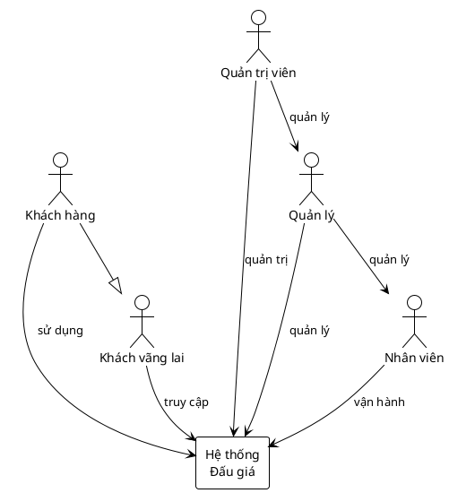
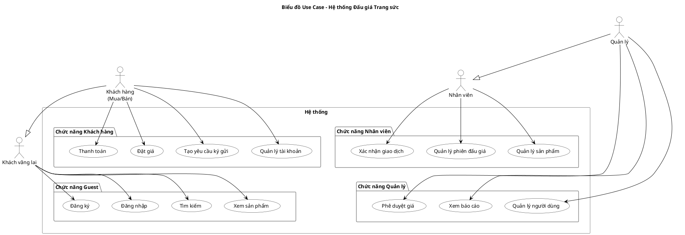
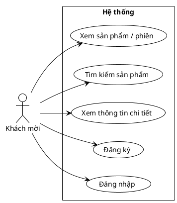
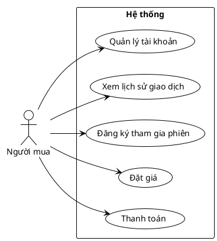
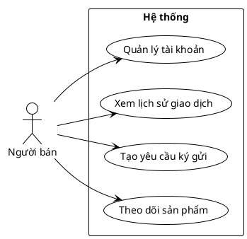

# Hệ thống quản lý đấu giá trang sức trực tuyến
I. Tổng quan dự án

# Mục tiêu

Mục tiêu của dự án là xây dựng một hệ thống đấu giá trang sức trực tuyến, nhằm kết nối người bán và người mua, đồng thời cung cấp cho công ty các công cụ để quản lý phiên đấu giá, sản phẩm và giao dịch một cách hiệu quả và minh bạch.

# Phạm vi

 Phạm vi dự án bao gồm các chức năng chính như: quản lý sản phẩm ký gửi, quản lý phiên đấu giá, quản lý người dùng (người bán, người mua, nhân viên), và quản lý giao dịch.

Việc tham gia đấu giá và đặt giá sẽ được thực hiện trực tuyến qua website, trong khi quy trình thẩm định giá và bàn giao sản phẩm sẽ được nhân viên thực hiện thủ công.

# Giả định và ràng buộc

* Hệ thống chỉ phục vụ cho hoạt động đấu giá trang sức của công ty, không phải là một sàn thương mại điện tử đa ngành hàng.

* Hệ thống quản lý các quy trình đấu giá và giao dịch, không phải là một phần mềm quản lý nhân sự hay kế toán chuyên sâu.

 * Hệ thống hỗ trợ ghi nhận trạng thái bàn giao sản phẩm, không tích hợp sâu với các đơn vị vận chuyển của bên thứ ba.

* Hệ thống có tích hợp cổng thanh toán cho việc giao dịch sản phẩm, không phải là một ví điện tử với đầy đủ chức năng nạp, rút, chuyển tiền.

# II. Yêu cầu chức năng

#  Các tác nhân 
* Guest (Khách vãng lai): Người dùng chưa đăng nhập.

* Seller (Người bán): Người dùng có tài khoản, thực hiện ký gửi trang sức để đấu giá.

* Buyer (Người mua): Người dùng có tài khoản, tham gia vào các phiên đấu giá.

* Staff (Nhân viên): Nhân viên của công ty, chịu trách nhiệm vận hành chính (định giá, quản lý phiên).

* Manager (Quản lý): Cấp quản lý, chịu trách nhiệm phê duyệt và giám sát.

* Admin (Quản trị viên): Người có quyền cao nhất, quản trị toàn bộ hệ thống.


<details>
<summary> Code PlantUML</summary>


</details>


# Các chức năng chính

##  Guest:

* Xem sản phẩm/phiên đấu giá: Cho phép xem danh sách các sản phẩm và các phiên đấu giá đang diễn ra hoặc sắp tới.

* Tìm kiếm sản phẩm: Cho phép người dùng tìm kiếm sản phẩm dựa trên tên, loại trang sức, khoảng giá khởi điểm...

* Xem thông tin chi tiết sản phẩm: Hiển thị đầy đủ thông tin của một sản phẩm, bao gồm mô tả, chất liệu, hình ảnh, video, giá khởi điểm, và lịch sử các mức giá đã được đặt (nếu phiên đang diễn ra).

* Đăng ký: Tạo tài khoản mới để có thể tham gia với vai trò người mua hoặc người bán.

* Đăng nhập: Đăng nhập vào hệ thống bằng tài khoản đã đăng ký.

## Buyer & Seller:
* Quản lý tài khoản: Cập nhật thông tin cá nhân, thay đổi mật khẩu, quản lý địa chỉ và thông tin thanh toán.

* Tạo yêu cầu ký gửi (Seller): Điền form để gửi yêu cầu đấu giá cho sản phẩm của mình, bao gồm mô tả, hình ảnh và giá mong muốn.

* Theo dõi sản phẩm (Seller): Xem trạng thái các sản phẩm đã ký gửi (chờ duyệt, đã định giá, đang đấu giá, đã bán).

* Đăng ký tham gia phiên (Buyer): Đăng ký để có quyền tham gia và đặt giá trong một phiên đấu giá cụ thể.

* Đặt giá (Buyer): Thực hiện đặt giá cho sản phẩm mong muốn trong thời gian phiên đấu giá diễn ra.

* Lịch sử giao dịch: Xem lại lịch sử các sản phẩm đã bán (đối với Seller) hoặc lịch sử các phiên đã tham gia và các sản phẩm đã thắng (đối với Buyer).

* Thanh toán (Buyer): Thực hiện thanh toán trực tuyến cho sản phẩm đã thắng cuộc.

## Staff:
* Quản lý sản phẩm: Tiếp nhận yêu cầu ký gửi, thẩm định chất lượng, cập nhật thông tin chi tiết và hình ảnh cho sản phẩm.

* Quản lý phiên đấu giá:

* Tạo phiên: Lên lịch phiên đấu giá mới, ấn định thời gian, thêm sản phẩm vào phiên.

* Vận hành phiên: Bắt đầu, tạm dừng, hoặc kết thúc một phiên đấu giá.

* Quản lý giao dịch: Xác nhận thanh toán thành công từ người mua và cập nhật trạng thái để tiến hành bàn giao sản phẩm.

* Hỗ trợ người dùng: Xem và phản hồi các yêu cầu hỗ trợ từ người dùng.

## Manager:
* Phê duyệt giá: Xem xét và phê duyệt mức giá khởi điểm cuối cùng do nhân viên đề xuất cho các sản phẩm quan trọng.

* Quản lý nhân viên: Xem danh sách nhân viên và hiệu suất làm việc.

* Xem báo cáo: Truy cập các báo cáo thống kê về doanh thu, số lượng sản phẩm, hiệu quả của các phiên đấu giá.

* Quản lý phí và hoa hồng: Cấu hình các mức phí giao dịch áp dụng cho người mua và người bán.

## Admin:

* Quản lý tài khoản: Có toàn quyền xem, tạo, sửa, xóa, khóa/mở khóa tài khoản của tất cả người dùng trong hệ thống.

* Giám sát hệ thống: Theo dõi toàn bộ hoạt động, lịch sử giao dịch, và các log hệ thống để đảm bảo an ninh và ổn định.

* Cấu hình hệ thống: Quản lý các cài đặt chung, các quy định, và các tham số cốt lõi của website.

# Biểu đồ Use Case

<details>
<summary> Code PlantUML</summary>


</details>


 


# Biểu đồ Use Case chi tiết
## Chữc năng Guest
<details>
<summary> Code PlantUML</summary>


</details>


## Chức năng Buyer
<details>
<summary> Code PlantUML</summary>


</details>


## Chức năng Seller
<details>
<summary> Code PlantUML</summary>


</details>


## Chức năng Staff
<details>
<summary> Code PlantUML</summary>

```plantum
@startuml
!theme plain
left to right direction

actor Staff as "Nhân viên"

rectangle "Hệ thống" {
    usecase "Quản lý sản phẩm" as UC1
    usecase "Quản lý phiên đấu giá" as UC2
    usecase "Tạo phiên" as UC3
    usecase "Vận hành phiên" as UC4
    usecase "Quản lý giao dịch" as UC5
    usecase "Hỗ trợ người dùng" as UC6
}

Staff --> UC1
Staff --> UC2
Staff --> UC3
Staff --> UC4
Staff --> UC5
Staff --> UC6
@enduml

```
</details>


## Chức năng Manager
<details>
<summary> Code PlantUML</summary>

```plantum
@startuml
!theme plain
left to right direction

actor Manager as "Giám đốc"

rectangle "Hệ thống" {
    usecase "Phê duyệt giá" as UC1
    usecase "Quản lý nhân viên" as UC2
    usecase "Xem báo cáo" as UC3
    usecase "Quản lý phí & hoa hồng" as UC4
}

Manager --> UC1
Manager --> UC2
Manager --> UC3
Manager --> UC4
@enduml
```
</details>


## Chức năng Admin
<details>
<summary> Code PlantUML</summary>

```plantum
@startuml
!theme plain
left to right direction

actor Admin as "Quản trị viên"

rectangle "Hệ thống" {
    usecase "Quản lý tài khoản người dùng" as UC1
    usecase "Giám sát hệ thống" as UC2
    usecase "Cấu hình hệ thống" as UC3
}

Admin --> UC1
Admin --> UC2
Admin --> UC3
@enduml
```
</details>


# Quy trình hoạt động
## Quy trình ký gửi sản phẩm

Quy trình này mô tả các bước từ khi người bán có nhu cầu đấu giá sản phẩm cho đến khi sản phẩm sẵn sàng được đưa lên sàn.

* Người bán: Đăng nhập vào hệ thống và chọn chức năng "Tạo yêu cầu ký gửi".

* Người bán: Điền đầy đủ thông tin mô tả sản phẩm, tải lên hình ảnh chi tiết và gửi yêu cầu.

* Hệ thống: Tiếp nhận yêu cầu, lưu trữ với trạng thái "Chờ duyệt" và tạo một thông báo mới cho các Nhân viên liên quan.

* Nhân viên: Truy cập danh sách các yêu cầu đang chờ, chọn một yêu cầu để bắt đầu quá trình thẩm định.

* Nhân viên: Dựa trên thông tin và hình ảnh, thực hiện thẩm định, đề xuất mức giá khởi điểm và cập nhật vào hệ thống.

* Nhân viên: Với các sản phẩm có giá trị cao, Nhân viên sẽ trình yêu cầu lên cho Giám đốc.

* Giám đốc: Xem xét yêu cầu, kiểm tra thông tin thẩm định và mức giá khởi điểm.

* Giám đốc: Thực hiện Phê duyệt hoặc Từ chối yêu cầu.

* Hệ thống: Cập nhật trạng thái cuối cùng cho sản phẩm .

* Hệ thống: Tự động gửi một thông báo (notification) đến Người bán về kết quả của yêu cầu ký gửi.


<details>
<summary> Code PlantUML</summary>

```plantum
@startuml
!theme plain
title Quy trình Ký gửi Sản phẩm

|Người bán|
start
:Đăng nhập & chọn "Tạo yêu cầu ký gửi";
:Điền thông tin & Gửi yêu cầu;

|Hệ thống|
:Tiếp nhận yêu cầu;
:Đặt trạng thái = "Chờ duyệt";
:Thông báo cho Nhân viên;

|Nhân viên|
:Tiếp nhận yêu cầu;
:Thẩm định & đề xuất giá khởi điểm;

if (Sản phẩm giá trị cao?) then (yes)
  :Trình yêu cầu lên Giám đốc;

  |Giám đốc|
  :Xem xét hồ sơ & Kiểm tra thông tin;
  if (Phê duyệt?) then (Duyệt)
    |Hệ thống|
    :Cập nhật trạng thái = "Sẵn sàng đấu giá";
  else (Từ chối)
    |Hệ thống|
    :Cập nhật trạng thái = "Bị từ chối";
  endif

else (no)
  |Hệ thống|
  :Cập nhật trạng thái = "Sẵn sàng đấu giá";
endif

|Hệ thống|
:Thông báo kết quả cho Nhân viên & Người bán;

|Người bán|
stop
@enduml
```
</details>


## Quy trình tham gia đấu giá
* Người mua: Đăng nhập và truy cập vào danh sách các phiên đấu giá đang hoặc sắp diễn ra.

* Người mua: Chọn một phiên đấu giá cụ thể và nhấn "Đăng ký tham gia".

* Hệ thống: Ghi nhận việc đăng ký và cho phép Người mua truy cập vào phòng đấu giá khi phiên bắt đầu.

* Hệ thống: Khi phiên đấu giá bắt đầu, hệ thống hiển thị sản phẩm, giá cao nhất hiện tại và đồng hồ đếm ngược.

* Người mua: Nhập mức giá mong muốn (phải cao hơn giá hiện tại + bước giá tối thiểu) và nhấn nút "Đặt giá".

* Hệ thống: Xác thực mức giá.

* Nếu hợp lệ: Ghi nhận mức giá mới, cập nhật lại thông tin "giá cao nhất" và "người giữ giá" trên giao diện của tất cả người dùng trong phiên.

* Nếu không hợp lệ: Hiển thị thông báo lỗi cho Người mua.

* Hệ thống: Khi đồng hồ đếm ngược kết thúc, hệ thống sẽ chốt phiên cho sản phẩm đó.

* Hệ thống: Tự động xác định người giữ giá cuối cùng là người thắng cuộc.

* Hệ thống: Gửi thông báo thắng cuộc đến cho Người mua và tạo một giao dịch mới đang chờ thanh toán.

<details>
<summary> Code PlantUML</summary>

```plantum
@startuml
!theme plain
title Quy trình Tham gia và Đấu giá

|Người mua|
start
:Đăng nhập & Tìm phiên đấu giá;
:Đăng ký tham gia phiên;

|Hệ thống|
:Tiếp nhận đăng ký;
:Cho phép truy cập "phòng đấu giá"\nkhi phiên bắt đầu;
:Đến thời điểm bắt đầu → Khởi tạo phiên & đếm ngược;

while (Còn thời gian?) is (yes)
  :Hiển thị sản phẩm,\nGiá cao nhất & Người giữ giá,\nThời gian còn lại;

  |Người mua|
  :Nhập mức giá >=\nGiá hiện tại + Bước tối thiểu;
  :Nhấn "Đặt giá";

  |Hệ thống|
  if (Giá đặt hợp lệ?) then (yes)
    :Ghi nhận giá mới;
    :Cập nhật "Giá cao nhất"\n& "Người giữ giá";
    :Broadcast cập nhật\nreal-time cho tất cả;
  else (no)
    :Thông báo lỗi cho Người mua;
  endif
endwhile (no)

: Xác định người thắng cuộc\n= Người giữ giá cuối cùng;
: Tạo "Giao dịch mới"\ntrạng thái "Chờ thanh toán";
: Gửi thông báo thắng cuộc\ncho Người mua;

|Người mua|
stop
@enduml
```
</details>


## Quy trình Thanh toán và Hoàn tất Giao dịch

* Người mua: Nhận được thông báo thắng cuộc và truy cập vào mục "Giao dịch của tôi".

* Người mua: Chọn giao dịch đang chờ và nhấn "Tiến hành thanh toán".

* Hệ thống: Chuyển hướng người dùng đến một cổng thanh toán an toàn của bên thứ ba.

* Người mua: Nhập thông tin và hoàn tất việc thanh toán trên cổng thanh toán.

* Hệ thống: Nhận tín hiệu xác nhận thanh toán thành công từ cổng thanh toán.

* Hệ thống: Cập nhật trạng thái giao dịch thành "Đã thanh toán" và gửi thông báo cho Nhân viên.

* Nhân viên: Nhận thông báo, chuẩn bị sản phẩm và liên hệ với Người mua để sắp xếp việc bàn giao.

* Nhân viên: Sau khi bàn giao sản phẩm thành công, Nhân viên cập nhật trạng thái cuối cùng của giao dịch thành "Đã hoàn tất".

* Hệ thống: Ghi nhận giao dịch đã kết thúc thành công. Dựa trên đó, hệ thống sẽ tính toán và lên lịch chuyển tiền cho Người bán sau khi đã trừ đi các khoản phí dịch vụ.

<details>
<summary> Code PlantUML</summary>

```plantum
@startuml
!theme plain
skinparam defaultFontName Arial
title Quy trình Thanh toán và Hoàn tất Giao dịch

|Hệ thống|
start
: Tạo giao dịch "Chờ thanh toán";
: Gửi thông báo thắng cuộc cho Người mua;

|Người mua|
: Mở "Giao dịch của tôi";
: Chọn giao dịch đang chờ và nhấn "Thanh toán";

|Hệ thống|
: Chuyển hướng sang cổng thanh toán;

|Cổng thanh toán|
: Hiển thị form thanh toán;
: Người mua nhập thông tin & xác nhận;
: Xử lý giao dịch;

|Hệ thống|
: Nhận kết quả từ cổng thanh toán;
if (Thanh toán thành công?) then (Yes)
  : Cập nhật trạng thái = "Đã thanh toán";
  : Thông báo cho Nhân viên;

  |Nhân viên|
  : Chuẩn bị sản phẩm & liên hệ bàn giao;
  : Bàn giao sản phẩm;
  : Cập nhật trạng thái cuối = "Đã hoàn tất";

  |Hệ thống|
  : Ghi nhận giao dịch đã kết thúc;
  : Tính phí dịch vụ & số tiền chuyển;
  : Lên lịch chuyển tiền cho Người bán;
  stop
else (No)
  : Ghi nhận lỗi thanh toán;
  : Thông báo thanh toán thất bại cho Người mua;
  stop
endif
@enduml

```
</details>


